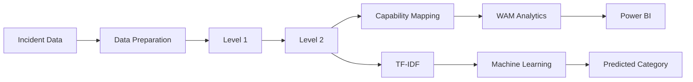

# Analytics 2.0 – Incident Intelligence & Categorization

> Enterprise incident analytics solution combining Python, rule-based text classification, operational analytics, Power BI, and machine learning.

Analytics 2.0 was developed to automate the analysis and categorization of large volumes of IT incident data.

The solution evolved through **five major development versions**, progressing from keyword-based categorization to hierarchical classification, capability-level analytics, repetitive issue detection, and machine-learning-based text classification.

The project originated during a global enterprise hackathon, progressed through **three winning stages**, and was subsequently adopted across **130+ enterprise accounts**.

---

## Business Problem

Large incident datasets required significant manual effort for:

- Incident categorization
- Data cleansing and preparation
- Applying classification logic
- Identifying repetitive issues
- Analyzing trends across operational teams
- Converting technical incident data into actionable insights

Analytics 2.0 was developed to automate and standardize this workflow.

```text
Raw Incident Data
        ↓
Data Preparation
        ↓
Automated Categorization
        ↓
Operational Enrichment
        ↓
Repetitive Issue Analysis
        ↓
Machine Learning
        ↓
Power BI Analytics
        ↓
Operational Insights
```

---

## Solution Evolution

Analytics 2.0 was developed iteratively across five major versions.

| Version | Development | Purpose |
|---|---|---|
| **V1** | Level 1 keyword / regex mapping | Automate high-level incident categorization |
| **V2** | Level 1 + Level 2 hierarchical mapping | Introduce detailed and scalable categorization |
| **V3** | Capability mapping | Provide broader operational ownership and leadership visibility |
| **V4** | WAM analytics | Detect repetitive issues and changing incident trends |
| **V5** | Machine learning classification | Learn classification patterns from historical incident descriptions |

```text
V1
Rule-Based Level 1 Classification
        ↓
V2
Hierarchical Level 1 + Level 2 Classification
        ↓
V3
Capability-Level Mapping
        ↓
V4
Repetitive Issue & Trend Analytics
        ↓
V5
Machine Learning Classification
```

For the complete technical journey, see [`docs/solution-evolution.md`](docs/solution-evolution.md).

---

## My Role

### Developer & Tester

My primary contributions included:

- Python development for incident analytics and classification
- Development and enhancement of the solution across V1–V5
- Level 1 and Level 2 classification implementation
- Capability mapping implementation and testing
- WAM repetitive issue analytics
- Machine-learning implementation and model evaluation
- Power BI dashboard and analytics development
- Testing and validation of solution outputs
- Iterative technical improvements across solution versions

My primary hands-on development responsibilities were the **Python analytics workflow and Power BI implementation**.

---

## Solution Architecture



The solution separates data processing and analytical logic from the visualization layer.

Python performs the primary data preparation, classification and analytical processing, while Power BI provides interactive visualization and decision support.

For the detailed architecture, see [`docs/architecture.md`](docs/architecture.md).

---

## V1 – Level 1 Categorization

The first version introduced automated categorization using keywords and regular expressions applied to the incident `Description`.

```text
Incident Description
        ↓
Keyword / Regex Matching
        ↓
Level 1 Category
```

This established the baseline automated classification framework.

[`View V1 implementation`](src/v1_level1_mapping/)

---

## V2 – Hierarchical Classification

V2 introduced **Level 1 + Level 2 classification**.

It also improved maintainability by moving classification rules into mapping structures and processing them programmatically.

`tqdm` was introduced to provide progress visibility during processing of large datasets.

```text
Incident Description
        ↓
Level 1
        ↓
Level 2
        ↓
Detailed Classification
```

[`View V2 implementation`](src/v2_level1_level2_mapping/)

---

## V3 – Capability-Level Mapping

V3 introduced a broader operational ownership layer.

Individual working / assignment groups were mapped into broader capabilities such as:

- Network
- Storage
- Windows
- Database
- CloudOps

```text
Individual Operational Groups
             ↓
      Capability Mapping
             ↓
      Broader Capability
             ↓
    Leadership-Level Analysis
```

This enabled trends and improvement opportunities to be analyzed across multiple teams within a capability.

[`View V3 implementation`](src/v3_capability_mapping/)

---

## V4 – Whack-a-Mole (WAM) Analytics

V4 introduced repetitive issue and trend analysis.

Incidents were analyzed using:

```text
Configuration Item + Level 2 Category
```

A **30-day observation window** compared the first 20 days against the most recent 10 days.

```text
First 20 Days
      vs
Last 10 Days
      ↓
Magnitude of Change
      ↓
Issue Trend
```

Trend classifications included:

- Issue Increased
- Issue Existing
- Issue Decreasing
- Issue Solved

This shifted the solution from simply describing incidents toward identifying operational problems requiring attention.

[`View V4 implementation`](src/v4_wam_analytics/)

---

## V5 – Machine Learning Classification

V5 explored supervised machine learning for incident text classification.

Historical categorized incident descriptions were transformed using **TF-IDF**, and multiple classification algorithms were evaluated.

```text
Historical Incident Descriptions
              ↓
            TF-IDF
              ↓
        Model Training
              ↓
       Model Comparison
              ↓
          LinearSVC
              ↓
    Predicted Classification
```

### Model Evaluation

| Model | Mean Accuracy |
|---|---:|
| **LinearSVC** | **95%** |
| Logistic Regression | 91% |
| Multinomial Naive Bayes | 81% |
| Random Forest Classifier | 50% |

LinearSVC produced the strongest result during the original project evaluation and was selected for the classification workflow.

> These results represent the original project evaluation. They are not generated from the small synthetic demonstration dataset included in this public repository.

[`View V5 implementation`](src/v5_ml_classification/)

---

## Power BI Analytics Layer

Power BI was used as the visualization and decision-support layer.

The analytical views supported areas such as:

- Incident volumes and KPIs
- Level 1 and Level 2 analysis
- Capability-level trends
- Repetitive issue analysis
- WAM trend status
- Drill-down investigation

Original Power BI files and screenshots are intentionally not published because they were developed using enterprise operational data.

The design and analytical approach are documented here:

[`Power BI Analytics Layer`](docs/dashboard-design.md)

---

## Business Impact

Analytics 2.0 delivered value across automation, standardization, analytics and operational decision support.

### Key Outcomes

**Categorization time**

```text
Hours → Minutes
```

**Standardization**

Introduced structured Level 1 and Level 2 categorization for more consistent incident analysis.

**Operational intelligence**

Extended traditional incident reporting into capability analysis, repetitive issue identification and trend monitoring.

**Reusability**

Created a reusable Python-based classification and analytics framework.

**Enterprise adoption**

Following the original innovation initiative, the solution was adopted across:

### 130+ Enterprise Accounts

This demonstrated practical applicability beyond the original hackathon prototype.

For more detail, see [`docs/business-impact.md`](docs/business-impact.md).

---

## Hackathon Journey

Analytics 2.0 was developed by a **3-member team** as part of a global enterprise technology hackathon.

The project progressed through three competitive stages:

```text
Regional Competition
        ↓
      WINNER
        ↓
Cross-Regional Competition
        ↓
      WINNER
        ↓
Global Final
        ↓
      WINNER
```

Following the competition, the solution progressed into broader enterprise adoption.

For the full project journey, see [`docs/hackathon-journey.md`](docs/hackathon-journey.md).

---


## Technology Stack

| Area | Technologies |
|---|---|
| Programming | Python |
| Data Processing | Pandas, NumPy |
| Text Processing | Regular Expressions |
| Hierarchical Classification | Level 1 / Level 2 mapping |
| Processing Monitoring | tqdm |
| Operational Analytics | Capability Mapping, WAM |
| Feature Engineering | TF-IDF |
| Machine Learning | scikit-learn |
| ML Models | LinearSVC, Logistic Regression, MultinomialNB, Random Forest |
| Visualization | Power BI |
| Model Persistence | Pickle |
| Documentation & Version Control | GitHub |

---

## Repository Structure

```text
analytics-2.0-incident-intelligence/
│
├── README.md
├── requirements.txt
├── .gitignore
│
├── src/
│   ├── v1_level1_mapping/
│   ├── v2_level1_level2_mapping/
│   ├── v3_capability_mapping/
│   ├── v4_wam_analytics/
│   └── v5_ml_classification/
│
├── config/
│   ├── sample_regex_rules.csv
│   └── sample_capability_mapping.csv
│
├── sample_data/
│   ├── synthetic_incidents.csv
│   └── README.md
│
└── docs/
    ├── solution-evolution.md
    ├── architecture.md
    ├── methodology.md
    ├── business-impact.md
    ├── hackathon-journey.md
    └── dashboard-design.md
```

---

## Documentation

Detailed documentation is available for different aspects of the project:

| Document | Description |
|---|---|
| [`Solution Evolution`](docs/solution-evolution.md) | Technical evolution from V1 to V5 |
| [`Architecture`](docs/architecture.md) | End-to-end solution architecture |
| [`Methodology`](docs/methodology.md) | Data analytics and ML methodology |
| [`Business Impact`](docs/business-impact.md) | Operational value and adoption |
| [`Hackathon Journey`](docs/hackathon-journey.md) | Competition and project journey |
| [`Power BI Design`](docs/dashboard-design.md) | Visualization and analytics layer |

---

## Running the Public Demo

Clone the repository and install the required dependencies:

```bash
pip install -r requirements.txt
```

Each development version is documented independently under `src/`.

For example:

```bash
python src/v1_level1_mapping/level1_mapping.py
python src/v2_level1_level2_mapping/hierarchical_mapping.py
python src/v3_capability_mapping/capability_mapping.py
python src/v4_wam_analytics/wam_analytics.py
python src/v5_ml_classification/ml_classification.py
```

The repository includes synthetic sample data and synthetic configuration mappings for demonstrating the technical concepts.

---

## Data Privacy & Confidentiality

This repository is a **sanitized portfolio representation** of the original project.

To protect confidential enterprise information, the repository intentionally excludes:

- Original incident datasets
- Customer and account names
- Employer/organization identifiers
- Internal team structures
- Internal URLs and infrastructure paths
- Production classification mappings
- Original Power BI files
- Dashboard screenshots containing enterprise data
- Production-trained machine-learning models
- Other confidential operational information

All sample incidents, identifiers, assignment groups and mapping examples included in this repository are synthetic.

---

## Project Summary

Analytics 2.0 demonstrates the progression of an analytics solution from a simple automation concept into a broader incident intelligence framework.

```text
Categorize
    ↓
Standardize
    ↓
Map Ownership
    ↓
Detect Repetition
    ↓
Analyze Trends
    ↓
Apply Machine Learning
    ↓
Visualize Insights
```

The project combines **Python development, data analytics, text classification, machine learning, operational analytics and Power BI** to address a practical enterprise-scale incident management problem.
