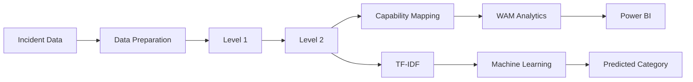

# Analytics 2.0 – Incident Intelligence & Categorization

An enterprise-scale data analytics and machine learning solution developed to automate incident categorization, identify repetitive issues, provide capability-level insights, and support data-driven operational improvements.

## Solution Architecture

For the complete technical architecture, see [`docs/architecture.md`](docs/architecture.md).

## Project Overview

Analytics 2.0 was developed to address the manual and time-consuming process of categorizing large volumes of IT incident data.

The solution evolved through five major development versions, progressing from keyword-based categorization to hierarchical classification, capability-level analytics, repetitive issue detection, and finally machine-learning-based text classification.

The solution was originally developed as part of a global enterprise hackathon and successfully progressed through three competitive stages:

- Regional Winner
- Cross-Regional Winner
- Global Top-Performer Winner

Following the hackathon, the solution was adopted across **130+ enterprise accounts**, demonstrating its practical value beyond the initial innovation initiative.

## Key Capabilities

- Automated incident categorization
- Level 1 and Level 2 hierarchical classification
- Capability-level incident analytics
- Repetitive issue and trend identification
- Machine learning-based text classification
- Power BI analytics and visualization
- Reusable classification framework for large incident datasets

## Solution Evolution

`V1 → V2 → V3 → V4 → V5`

**Keyword Mapping → Hierarchical Categorization → Capability Mapping → WAM Analytics → Machine Learning**

Detailed technical documentation for each version is available in the `src/` and `docs/` sections of this repository.

## My Role

**Developer & Tester**

My primary contributions included:

- Python development for the incident categorization and analytics workflows
- Development and iterative enhancement of the solution across V1–V5
- Implementation and testing of classification logic
- Development of the Power BI analytics and visualization layer
- Testing and validation of solution outputs
